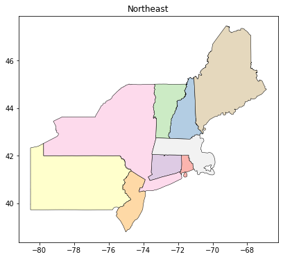
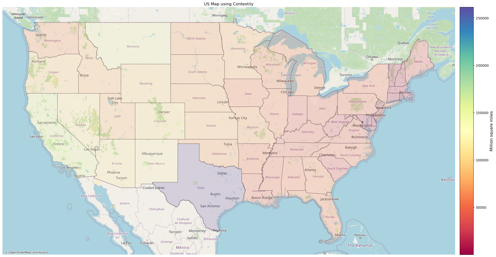
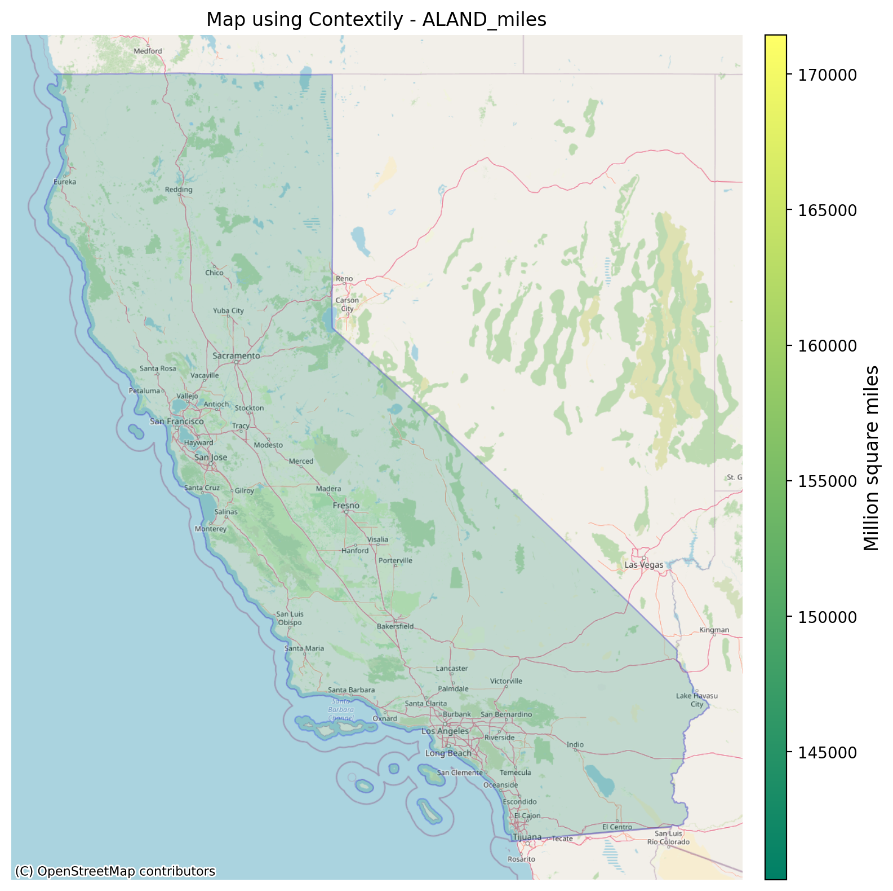

# Plot maps from the US Census using Geopandas and Contextily

Create rich map plots retrieving maps files from the US Census Bureau. The US Census provides maps at country, state, county levels.

Leverage Geopandas and Contextily to create shape maps or a combination of shape and raster plots.

## Map Plots

#### US Continental Map (shape file)


#### US Continental Map shape and rater tiles downloaded from the internet


#### Create Maps for specific states with different resolutions


## Jupyter Notebook and Mark Down File

Refer to **USCensusMaps.ipynb** or **USCensusMaps.md**.

## Dependencies

* `numpy`
* `matplotlib`
* `geopandas`
* `contextily`

## Installation

**Contextily**

Python 3 only (3.6 and above)
[Link to Contextily Docs](https://contextily.readthedocs.io/en/latest/index.html)

```sh
pip3 install contextily
```

or conda:

```sh
conda install contextily
```
**Geopandas**

[Link to GeoPandas Docs](https://geopandas.org/index.html)

The best way to install GeoPandas is using **conda** and **conda-forge** channel:

```sh
conda install -c conda-forge geopandas
```

## Environment

**I strongly suggest that you create a new environment**

Refer to **cartoenv.yml** file for specific libraries versions used.
